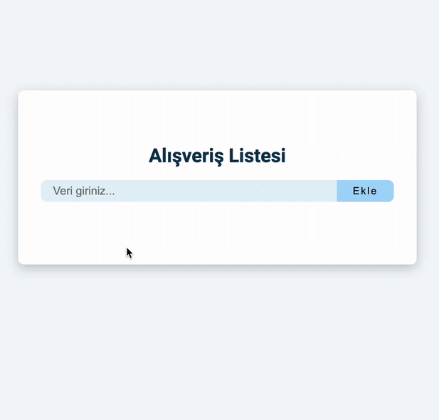

# Shopping List Application

This project is a simple application that allows users to create a shopping list, add products, update them, and delete them. Data is managed using `LocalStorage`, ensuring that the list persists even when the page is reloaded.

## Features

- **Add Product**: Add a new item to the shopping list.
- **Update Product**: Update the details of an existing item in the list.
- **Delete Product**: Remove unwanted products from the list.
- **Data Storage**: Data is stored using `LocalStorage`, ensuring the list remains intact even after page refreshes.

## Technologies Used

- **HTML** - For the basic structure of the project.
- **CSS** - For styling and layout.
- **JavaScript** - For CRUD operations and managing `LocalStorage`.

# crud_js
